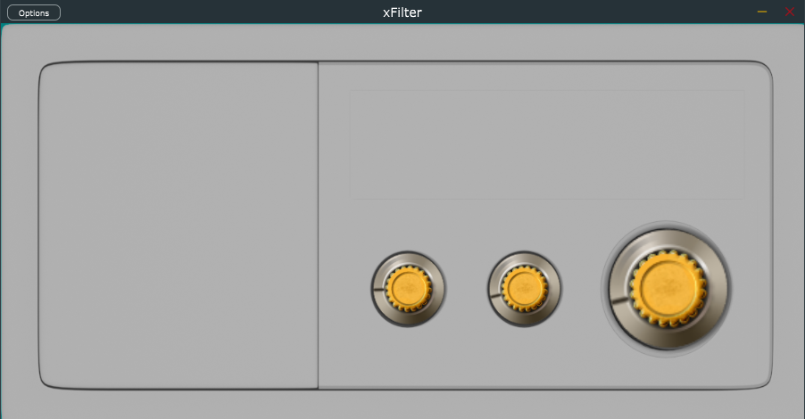

# EQ Notch/Peak Filter

⚠️ **Under Development**

This repository is presently in active development in anticipation of the upcoming 3-day workshop at Pulchowk Campus. During this phase, I am focusing on implementing various features and making improvements.

## Project Overview

This project introduces a simple cutoff filter plugin designed with learning in mind, especially for new students. The implemented peak filter enables users to adjust the following parameters:

- **Gain Control:** Modify the amplification or attenuation of the filtered signal.
- **Bandwidth Control:** Adjust the width of the frequency band affected by the filter.
- **Cutoff Frequency Control:** Set the central frequency where the peak filter is applied.

The primary goal of this project is to provide a practical reference for students to comprehend the essentials of audio signal processing and plugin development. The emphasis is on simplicity and clarity to enhance the learning experience.

## Build Instructions

### Building the Project
 1.Open the .jucer file using Projucer.	
 2.Export and build the source code using your preferred C++ development environment. We recommend using Visual Studio or any other editor that supports C++ development.

### Testing the Build
Suggested methods to test the build:
 1. Debug Mode
 * Ensure that the project is configured for debugging
 * Build the project in debug mode.
 * Run and test the application.

 2. VST3 Plugin
 * Locate the .vst3 file in the builds folder.
 * Test the VST3 plugin in your audio workstation or environment that supports VST3 plugins.

## Contributors
If you encounter any issues or have suggestions, please open an issue or create a pull request.

## TO:DO

1. **Spectrum Analyzer and dB Meter:** Enhance parameter readability with visual aids for better control.
2. **UI Enhancement:** Improve the UI for a more intuitive and appealing experience.
3. **Low/High Shelving Filter:** Implement filters to create a comprehensive EQ plugin.
4. **CMake Configuration (Branch):** Separate CMake configuration for a streamlined build process.
5. **CI/CD for AU/VST3:** Implement CI/CD for delivering fully functional plugins.

## Last Update

